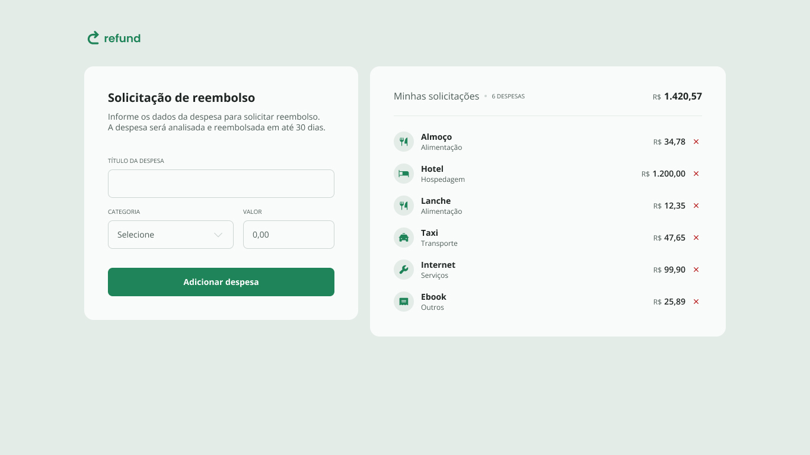

# Refund Application

A simple refund application using HTML, CSS, and JavaScript.

     <a href="https://refund-kts.netlify.app/">📱 Visit this Project</a> 
     <a href="https://www.figma.com/design/HnTPL0MBV2cRuIdN7cryOF/Sistema-de-reembolso-(Community)?node-id=3-376&p=f&t=N6v9XFWPwCHq5769-0">🎨 Figma</a>

    

## Tech Stack

